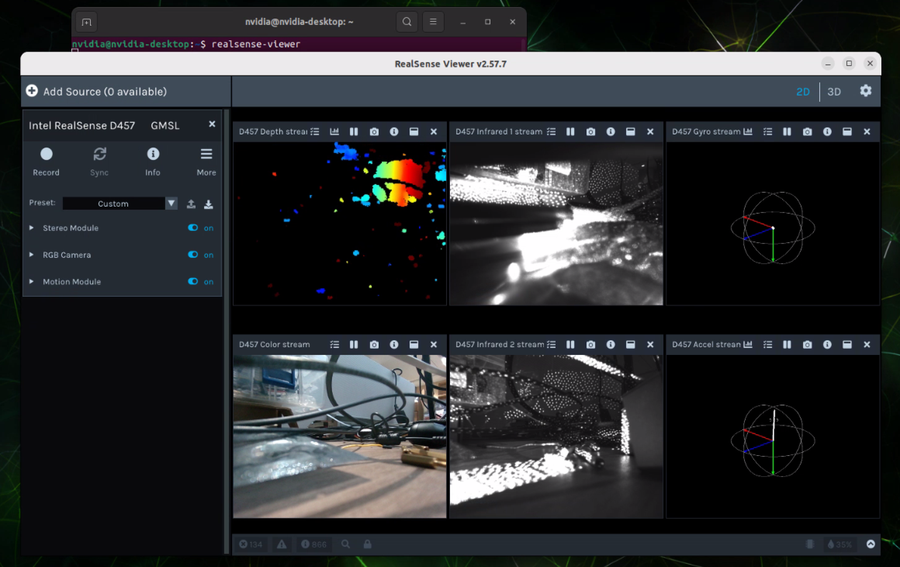

# D457 + D405 + FG12-12CH (JetPack 6.2.0 / R36.4.3) Deployment Guide

Package folder: `Realsense_D4XX_JAO_FG12_12CH_Driver_JP6.2.0_R36.4.3`

## 1. Overview

This package brings up Intel RealSense D457 / D405 cameras on the FG12 12CH carrier board.

- Board: Jetson AGX Orin (p3737 + p3701)
- Deserializers: 2 x MAX96712
  - Bus 9 (dser_a) -> D457
  - Bus 10 (dser_b) -> D405
- Each camera exposes 7 video nodes: depth / depth-md / color / color-md / ir / ir-md / imu
- With both cameras attached: 14 `/dev/video-rs-*` nodes total
- Librealsense should be >= version v2.58.+

## 2. Contents

### Kernel modules (ko)
- `tegra-camera.ko`
- `capture-ivc.ko`
- `nvhost-nvcsi-t194.ko`
- `videodev.ko`
- `d4xx.ko`
- `max9295.ko`
- `max9296.ko`
- `max96712.ko`
- `max96717.ko`

### Device tree overlay (dtbo)
- `tegra234-camera-d4xx-overlay-fg12-12ch-cams-0-4.dtbo`

### Helper script
- `copy_d4xx_to_target.fg12_12ch.sh`

## 3. Deployment

### 3.1 Copy to Jetson

```bash
scp -r Realsense_D4XX_JAO_FG12_12CH_Driver_JP6.2.0_R36.4.3 nvidia@<JETSON_IP>:
```

On Jetson:

```bash
cd ~/Realsense_D4XX_JAO_FG12_12CH_Driver_JP6.2.0_R36.4.3
```

### 3.2 Run the install script (sudo required)

```bash
sudo bash copy_d4xx_to_target.fg12_12ch.sh
```

The script backs up and installs all kernel modules, copies the dtbo to `/boot/`, and applies the overlay (`Jetson Camera FG12_12CH D4XX-CAM0-4`) via jetson-io.

### 3.3 Reboot

```bash
sudo reboot
```

## 4. Verification

```bash
lsmod | egrep 'd4xx|max9295|max9296|max96712|max96717|tegra_camera|capture_ivc|nvhost_nvcsi'
ls -l /dev/video-rs-*
```

Expected (both cameras attached), 14 nodes total:

```
video-rs-depth-0/1, video-rs-depth-md-0/1
video-rs-color-0/1, video-rs-color-md-0/1
video-rs-ir-0/1,    video-rs-ir-md-0/1
video-rs-imu-0/1
```

## 5. Debug Notes

- **POC register address**: FG12 12CH uses `0x319` (`F306_POC_ADDR`), not `0x326` (FG12 4CH).
- **CAM0_PWDN / CAM1_PWDN GPIO** (previously swapped, now fixed):
  - `CAM0_PWDN = TEGRA234_MAIN_GPIO(H, 3)` -> Pin93 / 397 / MAX96724_1 PWDN
  - `CAM1_PWDN = TEGRA234_MAIN_GPIO(H, 6)` -> Pin95 / 394 / MAX96724_2 PWDN
- **d4xx stream start timeout**: `DS5_START_MAX_TIME` increased from 2000 -> 5000 to cover camera FW cold-boot wake-up and avoid first-open depth-stream timeout.

## 6. Realsense Viewer



<br />
